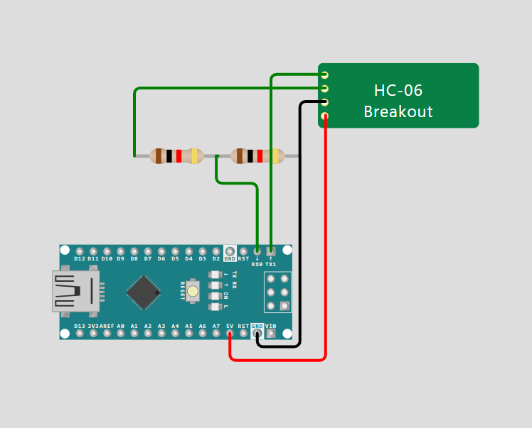
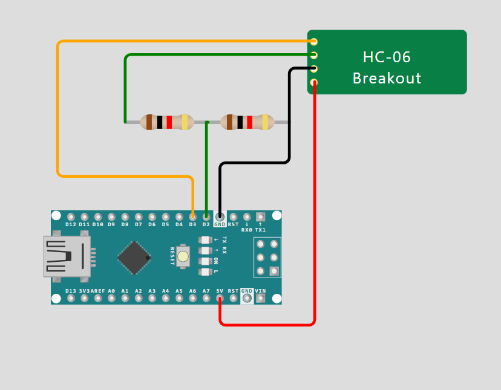

## Sample wiring
https://wokwi.com/projects/416609160367268865# Bluetooth Control Project

## Schematics




## Warning
When using the RX and TX pins on the Arduino Nano board for Bluetooth communication, be aware that these pins are also used for serial communication with the computer. Make sure to disconnect any serial connections before uploading new code or using the Bluetooth module to avoid conflicts.

## Project Overview
This project involves controlling devices via Bluetooth using an Arduino. The code is designed to manage Bluetooth connections and communication with other devices.

## Code Explanation
The main functionality is implemented in the relevant source files, which handle Bluetooth communication and device control.

## Key Components
- **Bluetooth Module**: Manages the Bluetooth connection.
- **Control Logic**: Handles commands received from connected devices.


## Usage Instructions
To use this code:
- Ensure you have the necessary hardware connections for the Bluetooth module.
- Upload the code to your Arduino board.
- Use a Bluetooth-enabled device to connect and send commands.

## Changing the Bluetooth Name
To change the Bluetooth name of your device, follow these steps:

1. **Locate the Bluetooth Initialization Code**: Open the source file where the Bluetooth module is initialized (usually in `setbluetooth-name.cpp` or a similar file).

2. **Modify the Name**: Look for a line of code that initializes the Bluetooth module with a name. It typically looks like this:
   ```cpp
   BluetoothSerial SerialBT;
   SerialBT.begin("YourDeviceName"); // Change "YourDeviceName" to your desired name
    ```
## Changing the Bluetooth Name Using $$$
You can also change the Bluetooth name using the `$$$` command. Follow these steps:

1. **Connect to the Bluetooth Module**: Make sure your Bluetooth device is connected to your computer or smartphone.

2. **Send the Command**: Open a serial terminal or a Bluetooth terminal app and send the following command: `$$$`

3. **Set the New Name**: After entering the command, type the following to set your desired Bluetooth name: `AT+NAMEYourNewName`

4. **Disconnect and Reconnect**: Disconnect and reconnect your Bluetooth device to see the new name reflected in the Bluetooth settings.

This method allows for quick renaming of the Bluetooth device without modifying the code.

## Conclusion
This document provides an overview of the Bluetooth control project, explaining the key components and their functionality. The project allows for wireless control of devices using Bluetooth technology.